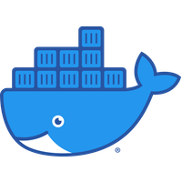
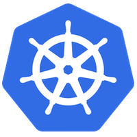

# Cloud Infrastructure Deployment

### TL:DR

* Project hosted on AWS  
* Two Jenkins pipelines for Continuous Integration and Continuos Deployment  
* First pipeline deploys cluster with CloudFormation  
* Second pipeline pull and build Docker image and deployed on Kubernetes  

---

## The Project

### Pipeline 1

**Step 1**: Authenticate on AWS  
**Step 2**: Create the Kubernetes cluster  
**Step 3**: Create the configuration file for the cluster  

### Pipeline: 2

**Step 1**: Code Linting  
**Step 2**: Build the Docker Image  
**Step 3**: Upload Docker Image to Docker Hub  
**Step 4**: Set current Kubectl context to the previously created cluster  
**Step 5**: Create the blue controller with the Docker Image  
**Step 6**: Create the green controller with the Docker Image  
**Step 7**: Create the load balancer in the Kubernetes cluster to route the traffic on the blue controller  
**Step 8**: For testing purposes, ask user to redirect the traffic manually to the green controller  
**Step 9**: Traffic redirected to the green controller. Blue/Green deployment working.  

---

## To run the project

> Clone the project  
> Create the first pipeline in Jenkins and run it. Note the cluster ID.  
> Create the second pipeline in Jenkins using the cluster ID and run it.  